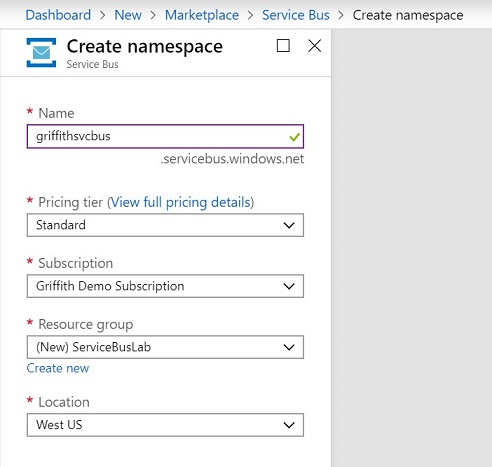
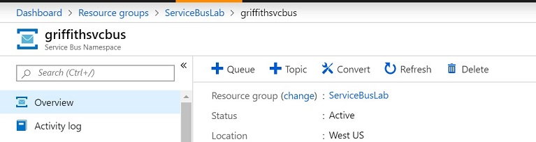

# Queue/Topic Lab

## Create Service Bus/Queue/Topic/Subscription

1) Navigate to the Azure portal: [https://portal.azure.com](https://portal.azure.com)
1) In the upper left of the screen select 'Create a Resource"
1) Search for 'Service Bus"
1) Click on 'Serice Bus' and then 'Create'
1) Fill in the following and click 'Create'
    * Name: Choose a globally unique name
    * Pricing Tier: Standard is minimally required for using Topics
    * Subscription: Target deployent subscription
    * Location: Target deployment region

    

1) Once the deployment is complete, navigate to your new Service Bus either by going to 'All Services' or the 'Resource Group' list
1) Once in the Service Bus, at the top of the screen click '+ Queue' to add a new queue

    

1) In the queue setup screen, provide a name for your queue and click 'Create'. Leave the rest of the settings as they are. You can try those out later.

    

1) Back at your Service Bus page, click on '+ Topic', which is directly next to the '+ Queue' you just used. (Note: If '+ Topic' is greyed out, you may have accidentally chosen 'Basic' as your 'Pricing Tier'. You can go to the 'Scale' settings to change the pricing tier.)

1) Again, just provide a topic name, and leave the rest as default.
1) Back in your Service Bus page, on the left side under 'Entities' click on 'Topics'.
1) Click on the topic you created
1) At the top of the screen click '+ Subscription'
1) Give your subscription a name, and again leave all the default values and then click 'Create'.

## Build your application
Lets build the application! This app will use the Azure Functions Core tools to create three functions.

* HTTP Trigger to write messages to the queue and topic
* Service Bus Queue Trigger to listen for queue messages
* Service Bus Topic Trigger to listen for topic messages

### Scafold out the application
1) From your prefered command/shell console navigate to the folder where you'd like to build your application
1) Create a new folder for your project and navigate into the foloder
```
mkdir MessagingLab
cd MessagingLab
```
1) Create the function project base using 'func init', selectint 'dotnet' as the worker runtime and 
    ```
    func init
    Select a worker runtime:
    1. dotnet
    2. node
    3. python (preview)
    4. powershell (preview)
    Choose option: 1
    
    dotnet        
    ```
1) Create the HTTP Trigger using 'func new', chosing option 2 for HttpTrigger and then providing your function name.
    ```
    griffith@DESKTOP-2PPKSOO:~/MessagingLab$ func new      
    Select a template:
    1. QueueTrigger
    2. HttpTrigger
    3. BlobTrigger
    4. TimerTrigger
    5. DurableFunctionsOrchestration
    6. SendGrid
    7. EventHubTrigger
    8. ServiceBusQueueTrigger
    9. ServiceBusTopicTrigger
    10. EventGridTrigger
    11. CosmosDBTrigger
    12. IotHubTrigger
    
    Choose option: 2
    Function name: ServiceBus_SendMsg
    ServiceBus_SendMsg
    
    The function "ServiceBus_SendMsg" was created successfully from the "HttpTrigger" template.
    ```

1) Repeat the same process to create a function using #8: ServiceBusQueueTrigger and #9: ServiceBusTopicTrigger

    Your project folder should look like the following, with some variation in the names of the cs files:
    ```
    griffith@DESKTOP-2PPKSOO:~/MessagingLab$ ls -1a
    .
    ..
    .gitignore
    .vscode
    MessagingLab.csproj
    ServiceBus_QueueTrigger.cs
    ServiceBus_SendMsg.cs
    ServiceBus_TopicTrigger.cs
    host.json
    local.settings.json
    obj          

    ```
1) Install the ServiceBus package
    ```bash
    dotnet add package Microsoft.Azure.ServiceBus --version 3.4.0
    ```

### Code the Message Send HTTP Trigger
1) Open your local.settings.json file and make it look like the following. These are the values we're externalizing from our code to make this code more portable.
    ```json
    {
        "IsEncrypted": false,
        "Values": {
            "AzureWebJobsStorage": "UseDevelopmentStorage=true",
            "FUNCTIONS_WORKER_RUNTIME": "dotnet",
            "SERVICEBUSCONNSTR": "<We'll update this later>",
            "QUEUENAME": "<Insert your queue name>",
            "TOPIC": "<Insert your topic name>",
            "SUBSCRIPTION": "<Insert your subscription name>"
            }
    }
    ```
1) Go back to the Azure portal and navigate to your Service Bus
1) Click on the 'Shared Access Polcies' link

1) Click on the 'RootManageSharedAccessKey'
    ```
    Note: We are using the root access key for this lab. I a production envioronment you would create multiple additional keys with different access levels as needed. You can click on the '+ Add' link to get an idea of the options available. 
    ```
1) Copy the 'Primary Connection String' and paste it into the SERVICEBUSCONNSTR setting in your local.settings.json file
1) Open your HTTP Trigger function code file
1) Add the following using statements:
    ```csharp
    using Microsoft.Extensions.Configuration;
    using System.Text;
    using Microsoft.Azure.ServiceBus;
    ```
1) At the top of your class add the folowing variables
    ```csharp
    static string ServiceBusConnectionString;
    static string QueueName;
    static string TopicName;
    static IQueueClient queueClient;
    static ITopicClient topicClient;
    ```
1) Optional: Remove the 'Get' option from the HTTPTrigger settings in your Run method. This will disable HTTP Get requests, which would be a bit odd to use...but techincally would still work.
1) At the top of your Run method, initialize the ConfigurationBuilder and pull your Service, Queue and Topic settings from your local confige file (Note: ConfigurationBuilder will look in Environment Variables first, which is how it will get these setting values when running in Azure, so you wont need to deploy your local.settings.json file)
    ```csharp
    var config = new ConfigurationBuilder()
        .AddEnvironmentVariables()
        .Build();
        
        ServiceBusConnectionString = config["SERVICEBUSCONNSTR"];
        QueueName = config["QUEUENAME"];
        TopicName = config["TOPIC"];
    ```
1) Change the log.LogInformation to log a message that a new Service Bus message has been recieved

    ```csharp
    log.LogInformation("New Service Bus Message Recieved....");
    ```
1) Add a new 'SendMessage' method that will send both the Queue message and the Topic Message.
    ```csharp
    static async Task SendMessagesAsync(string msgBody, ILogger log)
    {
        try
        {
            queueClient = new QueueClient(ServiceBusConnectionString, QueueName);
            topicClient = new TopicClient(ServiceBusConnectionString, TopicName);
            
            // Create a new message to send to the queue.
            string messageBody = $"Message: {msgBody}";
            var message = new Message(Encoding.UTF8.GetBytes(messageBody));
            
            // Send the message to the queue.
            await queueClient.SendAsync(message);
            // Send the message to the topic
            await topicClient.SendAsync(message);
        }
        catch (Exception ex)
        {
            log.LogInformation($"Message Send Error: {ex.InnerException}");
            throw ex;
        }
    }
    ```
1) Back in the 'Run' method, remove the line that is getting the 'Name' parameter from req.Query. We wont be using the query string to pass in values.
1) Change the following:
    ```csharp
    name = name ?? data?.name;
    // To
    string msg = data.msg;
    ```
1) Right after the line above, add a call to your SendMessageAsync method as follows
    ```csharp
    await SendMessagesAsync(msg, log);
    ```
1) Update your return method
    ```csharp
    return name != null
     ? (ActionResult)new OkObjectResult($"Hello, {name}")
     : new BadRequestObjectResult("Please pass a name on the query string or in the request body");

    // To

    return (ActionResult)new OkObjectResult($"Msg written to svc bus: {msg} \n");
    ```
1) Optional: Cleanup the Run method with a Try/Catch block to return a 'BadRequestObjectResult' on failure

Your code should now look similar to the following:
[Sample Code](https://raw.githubusercontent.com/swgriffith/MessagingLabs/master/src/MessagingLabs/ServiceBus_Sender.cs)

### Code the Queue and Topic Triggers
Most of the work for the Service Bus trigger client is handled by the Functions Core Tools when you created the function, however you will need to tell Azure Functions your connection string, queue and topic names. For this you'll modify the Run method attributes on each as follows.
1) Open you Queue trigger function
1) Update the ServiceBusTrigger attributes as follows
    ```csharp
    ServiceBusTrigger("%QUEUENAME%", Connection = "SERVICEBUSCONNSTR")
    ```
    **Note:** While the 'Connection' setting assumes you're providing the name of a configuration setting, and will check the config file, the Topic and Subscription do not. You can tell the runtime to check for these values in the config file by wrapping the value in %, hence %TOPIC% and %SUBSCRIPTION%.

1) Open your Topic Trigger function
1) Update the ServiceBusTrigger attributes as follows:
    ```csharp
    ServiceBusTrigger("%TOPIC%", "%SUBSCRIPTION%", Connection = "SERVICEBUSCONNSTR")
    ```
1) Make sure all of your work is save
1) Start the function to test, using func start at the root of your source code folder.
    ```bash
    func start
    ```